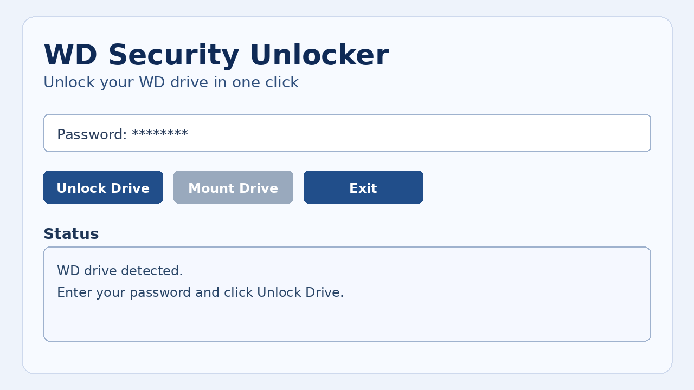
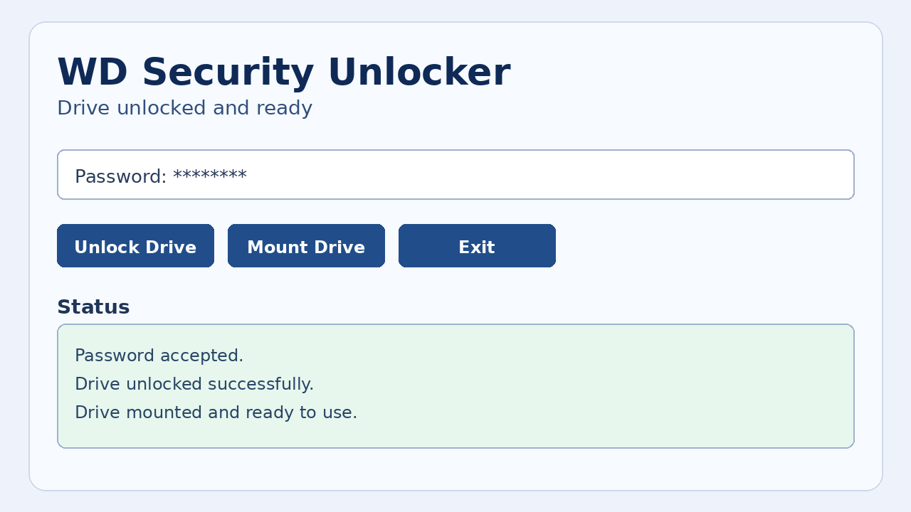

# wdpassport-utils

Source: originally from https://github.com/KenMacD/wdpassport-utils.

## What you can do
- Unlock a password-protected WD Security drive.
- Mount the drive right after unlock.
- Launch it like a normal Linux app (desktop/app menu).

## Run it (Linux)
1. `./build-linux.sh`
2. `./install-desktop-entry.sh`
3. Open **WD Security Unlocker** and unlock your drive.

## Screenshots

